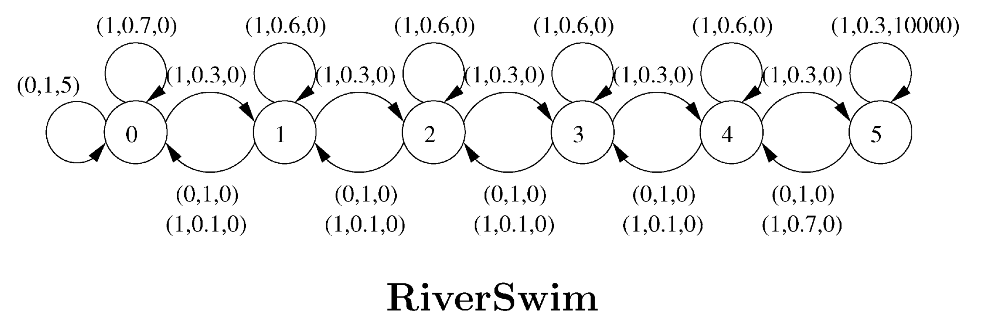

# RiverSwim Environment

A minimal implementation of the RiverSwim environment described in:

> [**Alexander L. Strehl, Michael L. Littman,**
> *An analysis of model-based Interval Estimation for Markov Decision Processes,
Journal of Computer and System Sciences,
Volume 74, Issue 8
(2008).* ](https://www.sciencedirect.com/science/article/pii/S0022000008000767)

## Overview

The RiverSwim environment is a classic small-scale Reinforcement Learning benchmark that features:
- A 1D chain of states representing a "river."
- Actions that let the agent swim left (safer but lower reward) or right (risky but with higher potential reward).
- Probabilistic transitions that mimic the current of the river, pushing the agent to the left side.

This repository contains a **minimal** Python implementation of the RiverSwim environment, intended for educational and research purposes.

## Environment Dynamics

In RiverSwim, the agent starts in the first state along a linear chain (e.g., from left to right). At each step:
1. The agent picks an action — typically "swim left" (0) or "swim right" (1).
2. Due to the strong current, even if the agent chooses to move to the right, there's a certain probability it stays in the same state or is swept back to the left.
3. The agent receives a reward when it reaches the extreme locations. On the leftmost state, it receives a small reward of 5 units, and on the rightmost state, a big reward of 10 thousands units.

A key challenge is balancing the exploration of the risky high-reward state on the right versus the safer low-reward state on the left.

Below is a figure from the original paper showing the schematic of RiverSwim:



_(Image credit: Strehl et al., 2008)_

## Installation

You can install this environment using either **pip** or **uv** (a minimal package manager/distribution manager example in Python).
**Note**: If you're unfamiliar with `uv`, you can skip directly to the `pip` instructions.

### 1. Installing via `uv`

1. Clone this repository:
   ```bash
   git clone https://github.com/cruz-lucas/riverswim.git
   cd riverswim
   ```
2. Install using `uv`:
   ```bash
   uv sync
   ```
   This should handle the necessary dependencies and set up the virtual environment.

### 2. Installing via `pip`

1. Clone this repository:
   ```bash
   git clone https://github.com/cruz-lucas/riverswim.git
   cd riverswim
   ```
2. Install the package locally:
   ```bash
   pip install .
   ```
   This command installs the RiverSwim environment into your Python environment (**consider using a virtual environment**, uv handles that for you).

## Usage

Once installed, you can use the environment as follows:

```python
import gym
import riverswim  # This import registers the environment

env = gym.make("RiverSwim-v0")
obs = env.reset()

done = False
total_reward = 0
while not done:
    action = env.action_space.sample()  # random action
    next_obs, reward, done, info = env.step(action)
    total_reward += reward

env.close()
print(f"Episode finished with total reward: {total_reward}")
```

If the environment is not tied to `gym.make`, you can still interact with it directly by instantiating it as described in the code within this repository. See `riverswim/env.py` for more details.

## Citing

If you use this implementation for your research or reference, please cite the original paper:

```
@article{STREHL20081309,
title = {An analysis of model-based Interval Estimation for Markov Decision Processes},
journal = {Journal of Computer and System Sciences},
volume = {74},
number = {8},
pages = {1309-1331},
year = {2008},
note = {Learning Theory 2005},
issn = {0022-0000},
doi = {https://doi.org/10.1016/j.jcss.2007.08.009},
url = {https://www.sciencedirect.com/science/article/pii/S0022000008000767},
author = {Alexander L. Strehl and Michael L. Littman},
keywords = {Reinforcement learning, Learning theory, Markov Decision Processes},
abstract = {Several algorithms for learning near-optimal policies in Markov Decision Processes have been analyzed and proven efficient. Empirical results have suggested that Model-based Interval Estimation (MBIE) learns efficiently in practice, effectively balancing exploration and exploitation. This paper presents a theoretical analysis of MBIE and a new variation called MBIE-EB, proving their efficiency even under worst-case conditions. The paper also introduces a new performance metric, average loss, and relates it to its less “online” cousins from the literature.}
}
```

## Contributing

Contributions and suggestions to improve this implementation are always welcome. Feel free to open an issue or a pull request.

## License

This project is licensed under the [MIT License](LICENSE). Please see the [LICENSE](LICENSE) file for more information.
